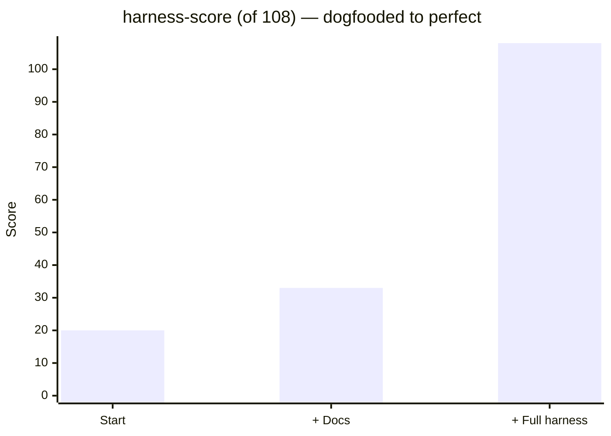

# Ada

**An agent-first code editor.** Open a folder, describe what you want, and Ada's coding agent reads, writes, and runs code to get it done — with every change isolated in its own git worktree until you approve it.

## Download

**Latest: v0.1.21**

| Platform                 | Download                                                                                                           |
| ------------------------ | ------------------------------------------------------------------------------------------------------------------ |
| 🪟 Windows               | [Ada-Setup-0.1.21.exe](https://github.com/black141312/ada-releases/releases/download/v0.1.21/Ada-Setup-0.1.21.exe) |
| 🍎 macOS (Apple Silicon) | [Ada-0.1.21-arm64.dmg](https://github.com/black141312/ada-releases/releases/download/v0.1.21/Ada-0.1.21-arm64.dmg) |
| 🍎 macOS (Intel)         | [Ada-0.1.21.dmg](https://github.com/black141312/ada-releases/releases/download/v0.1.21/Ada-0.1.21.dmg)             |
| 🐧 Linux                 | [Ada-0.1.21.AppImage](https://github.com/black141312/ada-releases/releases/download/v0.1.21/Ada-0.1.21.AppImage)   |

All versions: see [Releases](https://github.com/black141312/ada-releases/releases).

## Quick start

1. **Install and open Ada** — you can chat immediately with the free models, no account needed.
2. **Sign in with GitHub** (top-right) to unlock the full model catalog — 340+ coding-capable models including Claude, GPT, and Gemini.
3. **Open a folder** and ask Ada to build, fix, or explain. The agent works in an isolated git worktree (branch `ada/<id>`), so your working copy stays untouched until you merge.

## Highlights

- 🤖 **Full coding agent** — file edits, shell, search, 280+ skills, plan/ask/auto permission modes
- 🌿 **Worktree isolation by default** — review the agent's branch, merge when happy
- 🔀 **Switch models mid-chat** — models are stateless; the conversation carries over
- 🧠 **Grounded in your code** — a repo map primes every session, and semantic search runs a **local** embedding model (no API key, offline, your code never leaves the machine)
- 🧩 **Manage skills, MCP connectors & plugins** right in Settings — no config files
- 🖼️ Paste images, live context-usage meter, light & dark themes

## Built to be built by AI

 

We make an AI coding tool — so we hold our own codebase to the standard. [harness-score](https://paladini.github.io/harness-score/) measures how well a repo is set up for AI agents to work in safely: context, guardrails, automated sensors, and CI. Ada's codebase scores a **perfect 108/108 — L4, Self-correcting** (the top tier): every agent edit is auto-linted, every change is gated by CI, and destructive commands are blocked before they run.

## Install notes

Ada isn't code-signed by the app stores yet, so on first launch your OS shows a standard security prompt. This is normal for indie apps — here's how to allow it (one time per install). _(These prompts exist because the builds aren't signed with a paid certificate yet — the app itself is safe.)_

### 🍎 macOS

1. Open **Ada** — a dialog says _"Apple could not verify Ada is free of malware…"_ → click **Done** (not "Move to Bin").
2. Open **System Settings → Privacy & Security**.
3. Scroll down to the message _"Ada" was blocked to protect your Mac_ → click **Open Anyway**.
4. Launch **Ada** again → click **Open Anyway** (may ask for your password / Touch ID).

That's it — Ada opens normally from then on.

> On older macOS (13 or earlier): just **right-click Ada.app → Open → Open**.

### 🪟 Windows

Run the installer. If **SmartScreen** appears, click **More info → Run anyway**.

---

Questions or issues? [Open an issue](https://github.com/black141312/ada-releases/issues).
