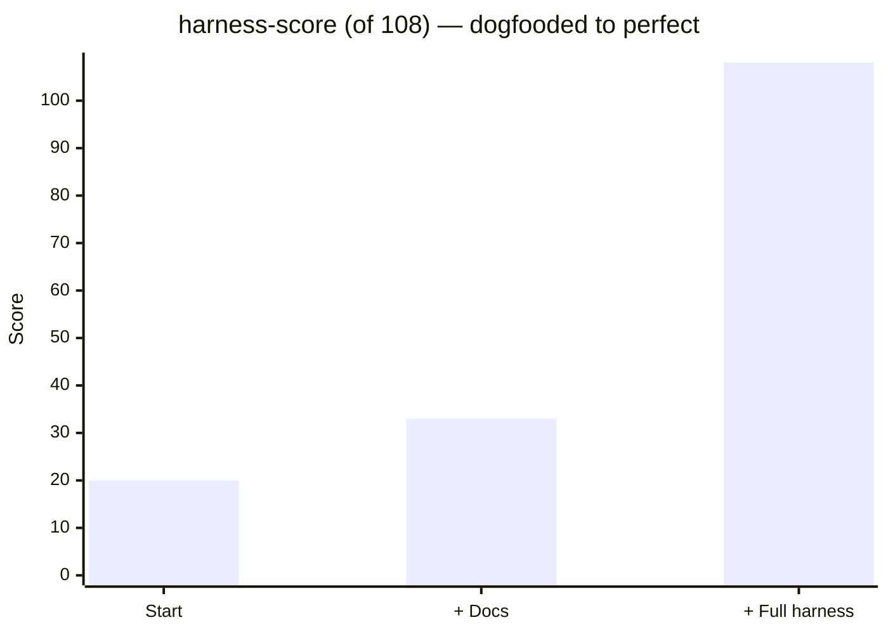

# Ada

**An agent-first code editor.** Open a folder, describe what you want, and Ada's coding agent reads, writes, and runs code to get it done — with every change isolated in its own git worktree until you approve it.

## Download

**Latest: v0.1.47**

| Platform                 | Download                                                                                                           |
| ------------------------ | ------------------------------------------------------------------------------------------------------------------ |
| 🪟 Windows               | [Ada-Setup-0.1.47.exe](https://github.com/black141312/ada-releases/releases/download/v0.1.47/Ada-Setup-0.1.47.exe) |
| 🍎 macOS (Apple Silicon) | [Ada-0.1.47-arm64.dmg](https://github.com/black141312/ada-releases/releases/download/v0.1.47/Ada-0.1.47-arm64.dmg) |
| 🍎 macOS (Intel)         | [Ada-0.1.47.dmg](https://github.com/black141312/ada-releases/releases/download/v0.1.47/Ada-0.1.47.dmg)             |
| 🐧 Linux                 | [Ada-0.1.47.AppImage](https://github.com/black141312/ada-releases/releases/download/v0.1.47/Ada-0.1.47.AppImage)   |

All versions: see [Releases](https://github.com/black141312/ada-releases/releases).

## Quick start

1. **Install and open Ada** — you can chat immediately with the free models, no account needed.
2. **Sign in with GitHub** (top-right) to unlock the full model catalog — 340+ coding-capable models including Claude, GPT, and Gemini.
3. **Open a folder** and ask Ada to build, fix, or explain. The agent works in an isolated git worktree (branch `ada/<id>`), so your working copy stays untouched until you merge.

## Highlights

- 🤖 **Full coding agent** — file edits, shell, search, 290+ skills, plan/ask/auto permission modes
- 🌿 **Worktree isolation by default** — review the agent's branch, merge when happy
- 🔀 **Switch models mid-chat** — models are stateless; the conversation carries over
- 🧠 **Grounded in your code** — a repo map primes every session, and semantic search runs a **local** embedding model (no API key, offline, your code never leaves the machine)
- 🔎 **Find anything** — `Ctrl+P` opens a file by name, `Ctrl+Shift+F` searches text across the project, both from one palette
- 📎 **Attach files as context** — pick them or drag them in from the tree; each becomes an `@name` chip you can click to open
- 💬 **Chat without opening a folder** — and your recent projects stay one hover away
- 🧩 **Manage skills, MCP connectors & plugins** right in Settings — no config files
- 🖼️ Paste images, live context-usage meter, light & dark themes

## What's new in v0.1.47

**Several chats at once.** One chat no longer holds up the rest. Start something long, switch to
another conversation, and keep working — each chat streams on its own, with its own queued message
and its own parked questions. The list tells you which is which: a spinning mark means Ada is
working, a still question mark means it is waiting on you.

**Background jobs you can actually read.** Work handed off to run in the background used to finish
into a void — the answer was written somewhere nothing could reach. Those jobs now appear in the
tasks panel under the chat that started them, survive a restart, and open on click to show what
they produced. You can stop one that is going nowhere, and the chat's badge says when one is done.

## Benchmarked, not vibes

Five tasks, one repository, Ada against Claude Code — same machine, same model
(Opus 4.7), same prompts, matched git checkouts:

- **2× less context** — 444k tokens against 893k
- **35–70% cheaper** — 35% across the full five-task mix ($3.05 against $4.68), 70%+ where the work leans on existing context
- **4.5× cheaper on the presentation** — Ada writes a real `.pptx` natively instead of hand-building markup
- In a four-build storefront shoot-out, Ada's build was **the only one a customer could log into** — users table, bcrypt password hashing, JWT sessions, and a role-gated admin, none of it asked for by the brief

The full report — screenshots of the app and every build, per-task tables, and method:
**[Ada-Report-v0.1.25.pdf](https://github.com/black141312/ada-releases/releases/download/v0.1.25/Ada-Report-v0.1.25.pdf)**

## Built to be built by AI

 

We make an AI coding tool — so we hold our own codebase to the standard. [harness-score](https://paladini.github.io/harness-score/) measures how well a repo is set up for AI agents to work in safely: context, guardrails, automated sensors, and CI. Ada's codebase scores a **perfect 108/108 — L4, Self-correcting** (the top tier): every agent edit is auto-linted, every change is gated by CI, and destructive commands are blocked before they run.

```mermaid
xychart-beta
    title "harness-score (of 108) — dogfooded to perfect"
    x-axis ["Start", "+ Docs", "+ Full harness"]
    y-axis "Score" 0 --> 108
    bar [20, 33, 108]
```

## Install notes

### 🍎 macOS

Signed and notarized by Apple — just open the `.dmg`, drag **Ada** to Applications, and launch it. No security prompts.

### 🪟 Windows

Run the installer. If **SmartScreen** appears, click **More info → Run anyway**.

---

Questions or issues? [Open an issue](https://github.com/black141312/ada-releases/issues).
