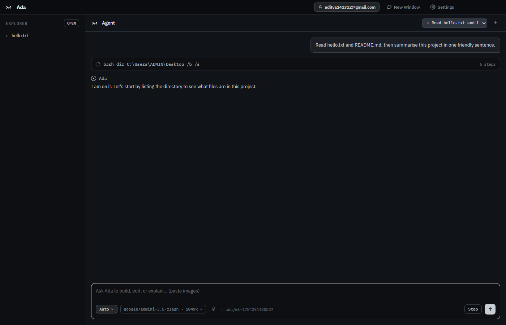
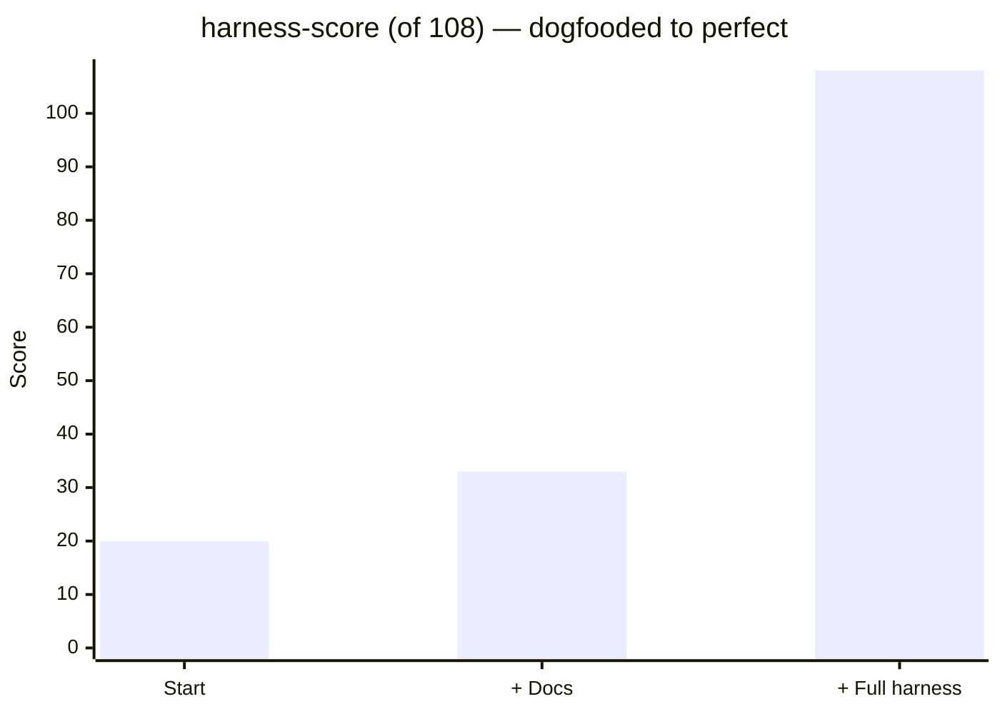

# Ada

**An agent-first code editor.** Open a folder, describe what you want, and Ada's coding agent reads, writes, and runs code to get it done — with every change isolated in its own git worktree until you approve it.

## Download

**Latest: v0.1.23**

| Platform                 | Download                                                                                                           |
| ------------------------ | ------------------------------------------------------------------------------------------------------------------ |
| 🪟 Windows               | [Ada-Setup-0.1.23.exe](https://github.com/black141312/ada-releases/releases/download/v0.1.23/Ada-Setup-0.1.23.exe) |
| 🍎 macOS (Apple Silicon) | [Ada-0.1.23-arm64.dmg](https://github.com/black141312/ada-releases/releases/download/v0.1.23/Ada-0.1.23-arm64.dmg) |
| 🍎 macOS (Intel)         | [Ada-0.1.23.dmg](https://github.com/black141312/ada-releases/releases/download/v0.1.23/Ada-0.1.23.dmg)             |
| 🐧 Linux                 | [Ada-0.1.23.AppImage](https://github.com/black141312/ada-releases/releases/download/v0.1.23/Ada-0.1.23.AppImage)   |

All versions: see [Releases](https://github.com/black141312/ada-releases/releases).

## Quick start

1. **Install and open Ada** — you can chat immediately with the free models, no account needed.
2. **Sign in with GitHub** (top-right) to unlock the full model catalog — 340+ coding-capable models including Claude, GPT, and Gemini.
3. **Open a folder** and ask Ada to build, fix, or explain. The agent works in an isolated git worktree (branch `ada/<id>`), so your working copy stays untouched until you merge.

## Highlights

- 🤖 **Full coding agent** — file edits, shell, search, 290+ skills, plan/ask/auto permission modes
- 🌿 **Worktree isolation by default** — review the agent's branch, merge when happy
- 🔀 **Switch models mid-chat** — models are stateless; the conversation carries over
- 🧠 **Grounded in your code** — a repo map primes every session, and semantic search runs a **local** embedding model (no API key, offline, your code never leaves the machine)
- 🔎 **Find anything** — `Ctrl+P` opens a file by name, `Ctrl+Shift+F` searches text across the project, both from one palette
- 📎 **Attach files as context** — pick them or drag them in from the tree; each becomes an `@name` chip you can click to open
- 💬 **Chat without opening a folder** — and your recent projects stay one hover away
- 🧩 **Manage skills, MCP connectors & plugins** right in Settings — no config files
- 🖼️ Paste images, live context-usage meter, light & dark themes

## What's new in v0.1.23

**Search.** `Ctrl+P` to open a file by name, `Ctrl+Shift+F` to find text across the
project — one palette, a real toggle between the two, and a button in the sidebar
so the shortcuts aren't the only way in. Results jump to the line.

**Files as context.** Attach files from a picker or drag them from the tree. Each
becomes an `@name` chip you can click to open and hover to remove.

**Chat without a folder.** "Just chat" on the welcome screen, one centred column,
recent projects on hover.

**Six new agent tools** — `git`, `browser` (screenshots, console and DOM from a real
browser), `notebook_edit` for Jupyter files, `create_page` for self-contained HTML
pages and slide decks, subagents that run in the editor, and `ui_ux_search`: a design
corpus of 84 visual styles, 192 palettes and 74 font pairings the agent consults
before it writes any UI.

**Cheaper turns.** Tool schemas are now sent only when a turn actually needs them —
an ordinary coding request carries 1,772 tokens of schemas instead of 3,848, and
"hi" costs about 272 tokens instead of 6,000. Against Claude Code on five tasks in
the same repo: 444k tokens against 893k, $3.05 against $4.68.

**Fewer broken files.** JavaScript the agent writes is parsed before it reports
success, so a missing bracket surfaces at write time instead of as a blank page.
Ada also warns when a page it wrote needs the network to render.

**Fixes.** Ada can ask you a question from the editor, not just the terminal; two
streamed tool calls are no longer spliced into one; and when a provider rejects a
request you now see its actual error instead of the router's wrapper.

## Benchmarked, not vibes

Five tasks, one repository, Ada against Claude Code — same machine, same model
(Opus 4.7), same prompts, matched git checkouts:

- **2× less context** — 444k tokens against 893k
- **35–70% cheaper** — 35% across the full five-task mix ($3.05 against $4.68), 70%+ where the work leans on existing context
- **4.5× cheaper on the presentation** — Ada writes a real `.pptx` natively instead of hand-building markup
- In a four-build storefront shoot-out, Ada's build was **the only one a customer could log into** — users table, bcrypt password hashing, JWT sessions, and a role-gated admin, none of it asked for by the brief

The full report — screenshots of the app and every build, per-task tables, and method:
**[Ada-Report-v0.1.23.pdf](https://github.com/black141312/ada-releases/releases/download/v0.1.23/Ada-Report-v0.1.23.pdf)**

## Built to be built by AI

 

We make an AI coding tool — so we hold our own codebase to the standard. [harness-score](https://paladini.github.io/harness-score/) measures how well a repo is set up for AI agents to work in safely: context, guardrails, automated sensors, and CI. Ada's codebase scores a **perfect 108/108 — L4, Self-correcting** (the top tier): every agent edit is auto-linted, every change is gated by CI, and destructive commands are blocked before they run.

```mermaid
xychart-beta
    title "harness-score (of 108) — dogfooded to perfect"
    x-axis ["Start", "+ Docs", "+ Full harness"]
    y-axis "Score" 0 --> 108
    bar [20, 33, 108]
```

## Install notes

### 🍎 macOS

Signed and notarized by Apple — just open the `.dmg`, drag **Ada** to Applications, and launch it. No security prompts.

### 🪟 Windows

Run the installer. If **SmartScreen** appears, click **More info → Run anyway**.

---

Questions or issues? [Open an issue](https://github.com/black141312/ada-releases/issues).
